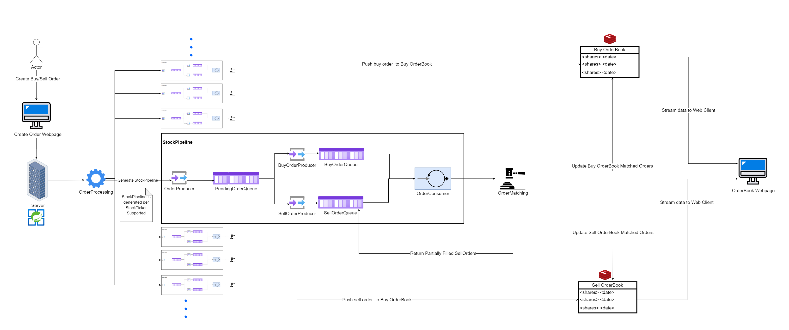

# Trading Engine Prototype

## Overview

A trading engine is a crucial component of any trading platform, handling vital functions such as order management, order matching, and maintaining the order book. 

This system integrates the essential features of a traditional trading engine within a multithreaded architecture, enabling the high-capacity handling of diverse order types, actions, stocks, and shares. It is designed for concurrent order matching, optimizing execution speed while preventing disruption to other users and their incoming orders.

## Workflow

* Upon startup, the server is ready to receive order objects (e.g., {ticker: APPL, action: BUY, shares: 18, ...}) through a client socket input stream.
* For each stock ticker processed, a StockPipeline is created to handle orders specific to that ticker. If a pipeline for a ticker like APPL doesn't exist, it's created; otherwise, the existing one is used.
* Orders are directed to their corresponding StockPipeline for processing. For APPL orders, they go to the APPL-specific pipeline.
* The StockPipeline splits incoming orders between two processes based on the order type: BuyOrderProducer and SellOrderProducer, both specific to the stock ticker.
* Orders are stored in separate buffers by the producers and also in ticker-specific Redis caches, which function as the order book (one for buy orders, one for sell orders).
* A StockConsumer continuously retrieves data from both the buy and sell order buffers.
* The order matching algorithm activates when there's a balanced mix of buy and sell orders, aiming to maximize order matches while minimizing partially filled orders.
* Fulfilled orders are removed from the Redis cache. Partially filled orders are marked and re-entered into the pipeline for potential completion by future orders.
* This process operates non-stop and concurrently until the system is shut down.
## Concurrency and Efficiency

This system is architected with concurrency at its core, ensuring efficient and non-blocking operations across all stages of order processing. The goal is to provide a robust and scalable trading engine that can handle a significant load of simultaneous user interactions.

## Getting Started

(Awaiting further updates)

## Contributing

(Awaiting further updates)

## License

(Awaiting further updates)

## Acknowledgments

(Awaiting further updates)

## Contact

(Awaiting further updates)

